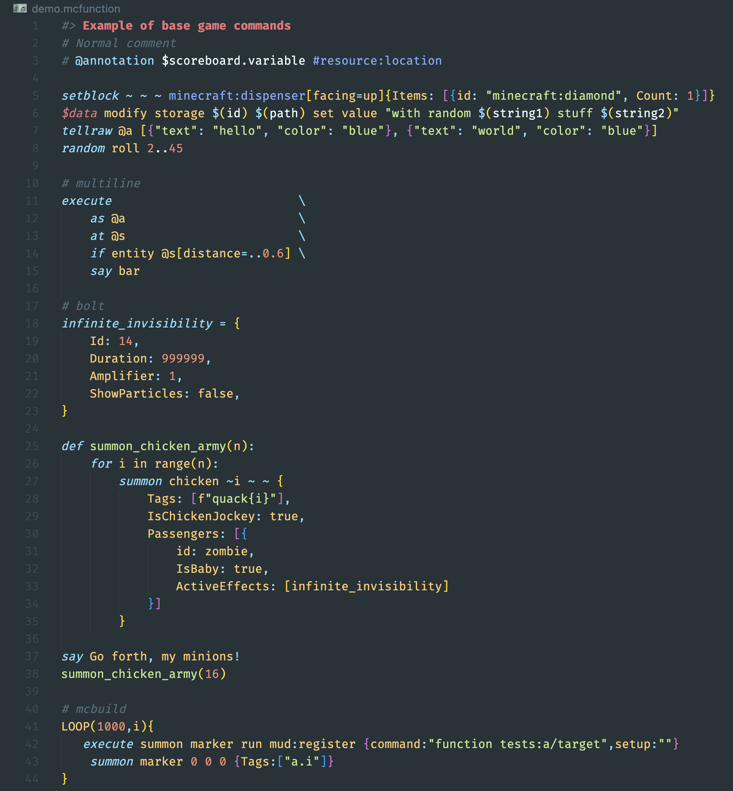

# language-mcfunction

> **Warning**
> This repo is heavily under construction and is targeting the 1.20.2 (23w31a snapshot)

## Goals

The aim of this repo is to provide a general, feature complete language spec for Minecraft commands. It is **not** geared towards error checking or the specific commands.

- [x] Add explicit macro support
  - [x] Add macro lines
  - [x] ~~Disable quoting~~ (not needed)
- [ ] Fix issues with nbt types
- [ ] Fix issues on resource names versus keywords
  - [ ] Likely will need to combine them to some extent

## Installing

### VSCode

1. Grab the `.vsix` extension from [here](https://github.com/rx-modules/language-mcfunction/releases).
2. Drag and drop it into VSCode (any folder).
3. Right click the file and click "Install Extension VSIX".

*Marketplace coming soon*

### Sublime Text

It is recommended you use [Package Control](https://packagecontrol.io/) to manage the package:

1. [Install Package Control](https://packagecontrol.io/installation) if it is not already present.
2. Run the `Package Control: Add Repository` [command](https://packagecontrol.io/docs/usage) and enter `https://github.com/rx-modules/language-mcfunction.git` to add the repository as a package.
3. Run the `Package Control: Install Package` and search for `language-mcfunction` to install it as you would a normal package.

> Note: You might need to remove Arc's language-mcfunction if you have it installed. You can do that via `Package Control: Remove Repository` and selecting https://github.com/Arcensoth/language-mcfunction then `Package Control: Remove Package` and selecting `language-mcfunction` from 2021.

This will keep the package updated with the repository automatically.

Otherwise you can clone the repository into user packages (e.g. `%appdata%\Sublime Text 3\Packages`) and update it manually.

## Acknowledgements

This repo is entirely dedicated to our beloved community member and friend, [Arcensoth](https://github.com/Arcensoth). His work on the original [language-mcfunction](https://github.com/Arcensoth/language-mcfunction) and overall contributions to the Minecraft Commands community was invaluable and he will be missed.

> Rest in Peace, Arcensoth
